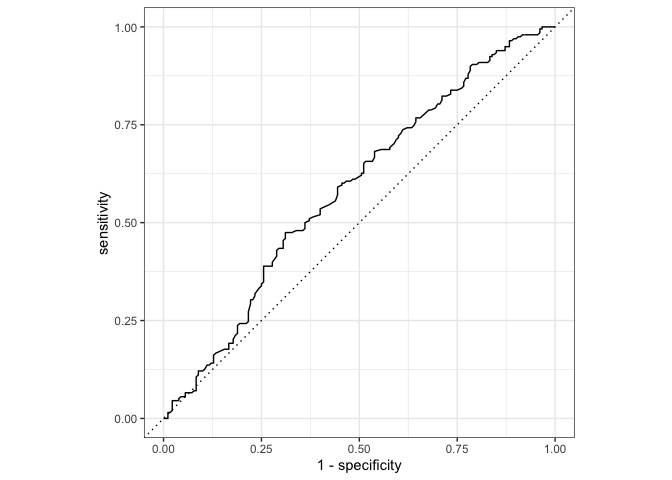
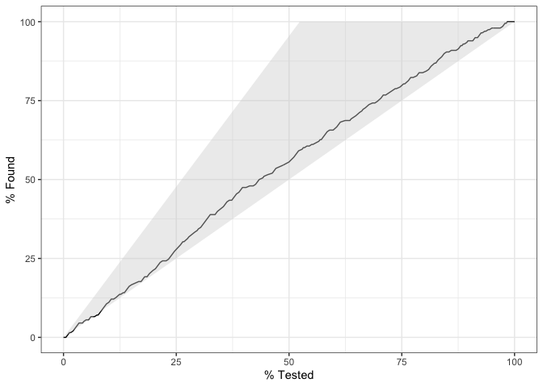
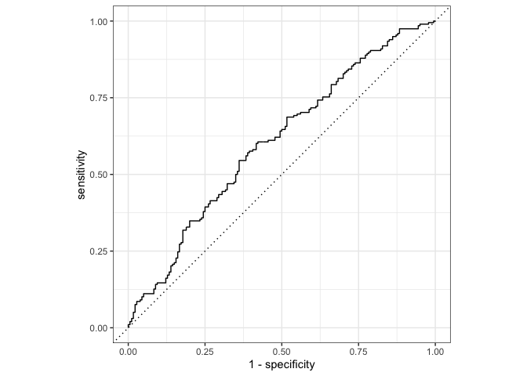
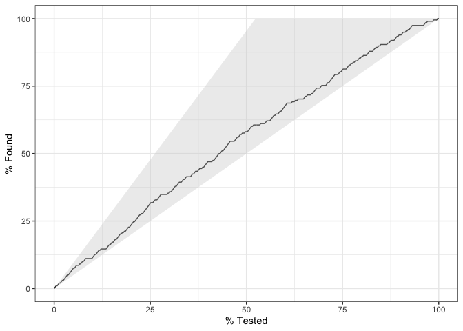

Assignment 3 - Part 2 - Diagnosing schizophrenia from voice
-----------------------------------------------------------

In the previous part of the assignment you generated a bunch of "features", that is, of quantitative descriptors of voice in schizophrenia. We then looked at whether we could replicate results from the previous literature. We now want to know whether we can automatically diagnose schizophrenia from voice only, that is, relying on the set of features you produced last time, we will try to produce an automated classifier. Again, remember that the dataset containst 7 studies and 3 languages. Feel free to only include Danish (Study 1-4) if you feel that adds too much complexity.

Issues to be discussed your report: - Should you run the analysis on all languages/studies at the same time? - Choose your best acoustic feature from part 1. How well can you diagnose schizophrenia just using it? - Identify the best combination of acoustic features to diagnose schizophrenia using logistic regression. - Discuss the "classification" process: which methods are you using? Which confounds should you be aware of? What are the strength and limitation of the analysis? - Bonus question: Logistic regression is only one of many classification algorithms. Try using others and compare performance. Some examples: Discriminant Function, Random Forest, Support Vector Machine, etc. The package caret provides them. - Bonus Bonus question: It is possible combine the output of multiple classification models to improve classification accuracy. For inspiration see, <https://machinelearningmastery.com/machine-learning-ensembles-with-r/> The interested reader might also want to look up 'The BigChaos Solution to the Netflix Grand Prize'

Learning objectives
-------------------

-   Learn the basics of classification in a machine learning framework
-   Design, fit and report logistic regressions
-   Apply feature selection techniques

### Let's start

We first want to build a logistic regression to see whether you can diagnose schizophrenia from your best acoustic feature. Let's use the full dataset and calculate the different performance measures (accuracy, sensitivity, specificity, PPV, NPV, ROC curve). You need to think carefully as to how we should (or not) use study and subject ID.

Then cross-validate the logistic regression and re-calculate performance on the testing folds. N.B. The cross-validation functions you already have should be tweaked: you need to calculate these new performance measures. Alternatively, the groupdata2 and cvms package created by Ludvig are an easy solution.

N.B. the predict() function generates log odds (the full scale between minus and plus infinity). Log odds &gt; 0 indicates a choice of 1, below a choice of 0. N.N.B. you need to decide whether calculate performance on each single test fold or save all the prediction for test folds in one datase, so to calculate overall performance. N.N.N.B. Now you have two levels of structure: subject and study. Should this impact your cross-validation? N.N.N.N.B. A more advanced solution could rely on the tidymodels set of packages (warning: Time-consuming to learn as the documentation is sparse, but totally worth it)

``` r
#load packages 
library(tidyverse)
```

    ## ── Attaching packages ───────────────────────────────────────────────────────────────────────────────────────── tidyverse 1.2.1 ──

    ## ✔ ggplot2 3.2.1     ✔ purrr   0.3.2
    ## ✔ tibble  2.1.3     ✔ dplyr   0.8.3
    ## ✔ tidyr   0.8.3     ✔ stringr 1.4.0
    ## ✔ readr   1.3.1     ✔ forcats 0.4.0

    ## ── Conflicts ──────────────────────────────────────────────────────────────────────────────────────────── tidyverse_conflicts() ──
    ## ✖ dplyr::filter() masks stats::filter()
    ## ✖ dplyr::lag()    masks stats::lag()

``` r
pacman::p_load(pacman, tidyverse, tidymodels, groupdata2, knitr, lme4, cvms, e1071, randomForest, caret)

#load dataframe
df <- read.csv("danishdata.csv")

##### LOGISTIC REGRESSION FOR ONE FEATURE ####
#from P1 we found out that speech rate might be the best feature, as it overlaps the least with 0, therefore we will assume that it is the best feature here

# 1: PARTITION DATA
#partioning the data into test and training data 
set.seed(5)
df_list <- partition(df, p = 0.2, cat_col = c("Diagnosis"), id_col = NULL, list_out = T) #p = 0.2 = 20% test data 
df_test = df_list[[1]] #dataframe with test data
df_train = df_list[[2]] #dataframe with training data

#make factors so that it does not scale them
df_train$Participant <- as.factor(df_train$Participant)
df_train$Study <- as.factor(df_train$Study)
df_train$Diagnosis <- as.factor(df_train$Diagnosis)
df_train$Trial <- as.factor(df_train$Trial)
df_train$uID <- as.factor(df_train$uID)
df_test$Participant <- as.factor(df_test$Participant)
df_test$Study <- as.factor(df_test$Study)
df_test$Diagnosis <- as.factor(df_test$Diagnosis)
df_test$Trial <- as.factor(df_test$Trial)
df_test$uID <- as.factor(df_test$uID)

# 2: RECIPE TO PREPROCESS THE DATA 
#recipe to preprocess the data (center and scale)
rec <- df_train %>% recipe(Diagnosis ~ .) %>% # defines the outcome
  step_center(all_numeric()) %>% # center numeric predictors
  step_scale(all_numeric()) %>% # scales numeric predictors
  step_corr(all_numeric()) %>% 
  #check_missing(everything()) %>%
  prep(training = df_train) #data it should use to execute, training data

#extract df_train from recipe, finalised data set
train_baked <- juice(rec)

#apply recipe to test to get final dataset
test_baked <- rec %>% bake(df_test)

#make sure it's factors again 
train_baked$Diagnosis <- as.factor(train_baked$Diagnosis)
test_baked$Diagnosis <- as.factor(test_baked$Diagnosis)

# 3: CREATE MODELS
#logistic regression on our best single feature
log_fit <- 
  logistic_reg() %>%
  set_mode("classification") %>% 
  set_engine("glm") %>%
  fit(Diagnosis ~ speechrate, data = train_baked)
log_fit
```

    ## parsnip model object
    ## 
    ## 
    ## Call:  stats::glm(formula = formula, family = stats::binomial, data = data)
    ## 
    ## Coefficients:
    ## (Intercept)   speechrate  
    ##    -0.09668     -0.29546  
    ## 
    ## Degrees of Freedom: 1517 Total (i.e. Null);  1516 Residual
    ## Null Deviance:       2101 
    ## Residual Deviance: 2069  AIC: 2073

``` r
# 4: APPLY MODEL TO TEST SET
#predict class, getting probablility how the model predicts the test data from train data
#log_class <- log_fit %>%
#  predict(new_data = test_baked)

#predict/get probabiltiy of class of the test data based on train data and model
#log_prop <- log_fit %>%
#  predict(new_data = test_baked, type = "prob") %>%
#  pull(.pred_1)

#get both of it at once (just additional), get it all in a table
test_results <- 
 test_baked %>% 
  select(Diagnosis) %>% 
  mutate(
    log_class = predict(log_fit, new_data = test_baked) %>% 
      pull(.pred_class),
    log_prob  = predict(log_fit, new_data = test_baked, type = "prob") %>% 
      pull(.pred_1)
  )

#examine the first 5 results 
test_results %>% 
  head(5) %>% 
  knitr::kable() 
```

| Diagnosis | log\_class |  log\_prob|
|:----------|:-----------|----------:|
| 0         | 1          |  0.6244584|
| 0         | 0          |  0.4290322|
| 0         | 0          |  0.4504748|
| 0         | 0          |  0.4657803|
| 0         | 0          |  0.3665733|

``` r
# 5: PERFORMANCE METRICS
#get accuracy and kappa
metrics(test_results, truth = Diagnosis, estimate = log_class) %>% 
  knitr::kable()
```

| .metric  | .estimator |  .estimate|
|:---------|:-----------|----------:|
| accuracy | binary     |  0.5634921|
| kap      | binary     |  0.1153944|

``` r
#accuracy: percent of agreement 
#kappa: agreement, corrected for just "by change"

#roc curve
test_results %>%
  roc_curve(truth = Diagnosis, log_prob) %>% 
  autoplot()
```



``` r
#best model if it would go straight up and then to the right, the dottet line is the worst 

#gain curve
test_results %>% 
  mutate(log_prob = 1 - log_prob) %>% # for the plot to show correctly (otherwise the line would be flipped)
  gain_curve(truth = Diagnosis, log_prob) %>% 
  autoplot()
```



``` r
#bottom of grey: just chance, top of grey: if it caputred everything in the data, line: where our model actually is 

#confusion matrix just for fun
confusionMatrix(test_results$log_class, test_results$Diagnosis, positive = NULL, dnn = c("Prediction", "Actual"))
```

    ## Confusion Matrix and Statistics
    ## 
    ##           Actual
    ## Prediction   0   1
    ##          0 137 104
    ##          1  61  76
    ##                                           
    ##                Accuracy : 0.5635          
    ##                  95% CI : (0.5118, 0.6141)
    ##     No Information Rate : 0.5238          
    ##     P-Value [Acc > NIR] : 0.067495        
    ##                                           
    ##                   Kappa : 0.1154          
    ##                                           
    ##  Mcnemar's Test P-Value : 0.001077        
    ##                                           
    ##             Sensitivity : 0.6919          
    ##             Specificity : 0.4222          
    ##          Pos Pred Value : 0.5685          
    ##          Neg Pred Value : 0.5547          
    ##              Prevalence : 0.5238          
    ##          Detection Rate : 0.3624          
    ##    Detection Prevalence : 0.6376          
    ##       Balanced Accuracy : 0.5571          
    ##                                           
    ##        'Positive' Class : 0               
    ## 

Multiple Cross Validation
=========================

``` r
#prepare data, make folds
dat <- groupdata2::fold(train_baked, k = 10, cat_col = 'Diagnosis', id_col = 'uID')
dat[["Diagnosis"]] <- factor(dat[["Diagnosis"]])

#model function: logistic regression and random forest
#that takes train_data and formula as arguments
#and returns the fitted model object
#logistic regression function
log_model_fn <- function(train_data, formula){
    logistic_reg() %>%  
    set_mode(mode = "classification") %>% 
    set_engine("glm") %>%
    fit(formula, data = train_data)
}

#random forest function
rf_model_fn <- function(train_data, formula){
    rand_forest(trees = 100, mode = "classification") %>%
      set_engine("randomForest") %>%
      fit(formula, data = train_data)
  }

#predict function
#usually just wraps stats::predict, takes test_data, model and formula arguments and returns vector with probabilities of class 1 (this depends on the type of task, gaussian, binomial or multinomial)
rf_predict_fn <- function(test_data, model, formula){
    stats::predict(object = model, new_data = test_data, type = "prob")[[2]]
  }

#cross-validation
#note the different argument names from cross_validate()
#logistic regression
CV_log <- cross_validate_fn(
  dat,
  model_fn = log_model_fn,
  formulas = c("Diagnosis ~ speechrate", "Diagnosis ~ iqr", 
               "Diagnosis ~ proportionSpoken", 
               "Diagnosis ~ pauseDuration", 
               "Diagnosis ~ speechrate + iqr", 
               "Diagnosis ~ speechrate + proportionSpoken", 
               "Diagnosis ~ speechrate + pauseDuration",
               "Diagnosis ~ iqr + proportionSpoken", 
               "Diagnosis ~ iqr + pauseDuration", 
               "Diagnosis ~ proportionSpoken + pauseDuration", 
               "Diagnosis ~ speechrate + iqr + proportionSpoken", 
               "Diagnosis ~ speechrate + iqr + pauseDuration", 
               "Diagnosis ~ iqr + proportionSpoken + pauseDuration", 
               "Diagnosis ~ speechrate + proportionSpoken + pauseDuration", 
               "Diagnosis ~ speechrate + iqr + proportionSpoken + pauseDuration"),
  fold_cols = '.folds',
  type = 'binomial',
  predict_fn = rf_predict_fn
)


#random forest
CV_rf <- cross_validate_fn(
  dat,
  model_fn = rf_model_fn,
  formulas = c("Diagnosis ~ speechrate", "Diagnosis ~ iqr", 
               "Diagnosis ~ proportionSpoken", 
               "Diagnosis ~ pauseDuration", 
               "Diagnosis ~ speechrate + iqr", 
               "Diagnosis ~ speechrate + proportionSpoken", 
               "Diagnosis ~ speechrate + pauseDuration",
               "Diagnosis ~ iqr + proportionSpoken", 
               "Diagnosis ~ iqr + pauseDuration", 
               "Diagnosis ~ proportionSpoken + pauseDuration", 
               "Diagnosis ~ speechrate + iqr + proportionSpoken", 
               "Diagnosis ~ speechrate + iqr + pauseDuration", 
               "Diagnosis ~ iqr + proportionSpoken + pauseDuration", 
               "Diagnosis ~ speechrate + proportionSpoken + pauseDuration", 
               "Diagnosis ~ speechrate + iqr + proportionSpoken + pauseDuration"),
  fold_cols = '.folds',
  type = 'binomial',
  predict_fn = rf_predict_fn
)
```

Test Best Model From Above On Test Data
=======================================

``` r
#the best model was in both cases Diagnosis ~ speech + iqr + proportionSpoken

#logistic regression
log_fit2 <- 
  logistic_reg() %>%
  set_mode("classification") %>% 
  set_engine("glm") %>%
  fit(Diagnosis ~ speechrate + iqr + proportionSpoken, data = train_baked)
log_fit2
```

    ## parsnip model object
    ## 
    ## 
    ## Call:  stats::glm(formula = formula, family = stats::binomial, data = data)
    ## 
    ## Coefficients:
    ##      (Intercept)        speechrate               iqr  proportionSpoken  
    ##          -0.1095           -0.5887           -0.3561            0.3557  
    ## 
    ## Degrees of Freedom: 1517 Total (i.e. Null);  1514 Residual
    ## Null Deviance:       2101 
    ## Residual Deviance: 2027  AIC: 2035

``` r
#get results
test_results2 <- 
 test_baked %>% 
  select(Diagnosis) %>% 
  mutate(
    log_class = predict(log_fit2, new_data = test_baked) %>% 
      pull(.pred_class),
    log_prob  = predict(log_fit2, new_data = test_baked, type = "prob") %>% 
      pull(.pred_1)
  )

#examine the first 5 results 
test_results2 %>% 
  head(5) %>% 
  knitr::kable() 
```

| Diagnosis | log\_class |  log\_prob|
|:----------|:-----------|----------:|
| 0         | 1          |  0.7183467|
| 0         | 0          |  0.3873438|
| 0         | 0          |  0.4142972|
| 0         | 0          |  0.4715993|
| 0         | 0          |  0.3943354|

``` r
#get accuracy and kappa
metrics(test_results2, truth = Diagnosis, estimate = log_class) %>% 
  knitr::kable()
```

| .metric  | .estimator |  .estimate|
|:---------|:-----------|----------:|
| accuracy | binary     |  0.5740741|
| kap      | binary     |  0.1420959|

``` r
#accuracy: percent of agreement 
#kappa: agreement, corrected for just "by change"

#roc curve
test_results2 %>%
  roc_curve(truth = Diagnosis, log_prob) %>% 
  autoplot()
```



``` r
#best model if it would go straight up and then to the right, the dottet line is the worst 

#gain curve
test_results2 %>% 
  mutate(log_prob = 1 - log_prob) %>% # for the plot to show correctly (otherwise the line would be flipped)
  gain_curve(truth = Diagnosis, log_prob) %>% 
  autoplot()
```



``` r
#bottom of grey: just chance, top of grey: if it caputred everything in the data, line: where our model actually is 

#confusion matrix just for fun
confusionMatrix(test_results2$log_class, test_results2$Diagnosis, positive = NULL, dnn = c("Prediction", "Actual"))
```

    ## Confusion Matrix and Statistics
    ## 
    ##           Actual
    ## Prediction   0   1
    ##          0 127  90
    ##          1  71  90
    ##                                           
    ##                Accuracy : 0.5741          
    ##                  95% CI : (0.5225, 0.6245)
    ##     No Information Rate : 0.5238          
    ##     P-Value [Acc > NIR] : 0.02816         
    ##                                           
    ##                   Kappa : 0.1421          
    ##                                           
    ##  Mcnemar's Test P-Value : 0.15602         
    ##                                           
    ##             Sensitivity : 0.6414          
    ##             Specificity : 0.5000          
    ##          Pos Pred Value : 0.5853          
    ##          Neg Pred Value : 0.5590          
    ##              Prevalence : 0.5238          
    ##          Detection Rate : 0.3360          
    ##    Detection Prevalence : 0.5741          
    ##       Balanced Accuracy : 0.5707          
    ##                                           
    ##        'Positive' Class : 0               
    ##
